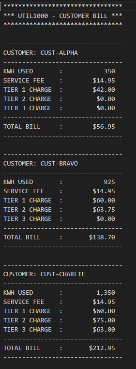

# **UTIL2000**
---



## Programmers
<!-- Using &nbsp to add white space so Github links are aligned -->
* *Bret Dunker         &nbsp;&nbsp;&nbsp;&nbsp;&nbsp;          [GitHub](https://github.com/KirbyD-YEAH)*

## Version
1.0

## Purpose
This COBOL program displays and calculates electricity bills for a predetermined number of customers. Each bill is calculated according to the amount of kilowatt-hours used, using a three-tier billing structure.

## Paragraphs
```000-MAIN```
* The driver code for the program. It displays a heading and then loads and processes three predefined customers of Alpha, Bravo, and Charlie. (NATO Phonetic Alphabet 😉)
* Then it calls the billing routine for each of the customers and ends.

```510-LOAD-CUST-ALPHA, 520-LOAD-CUST-BRAVO, 530-LOAD-CUST-CHARLIE```
* This code is going to load up a customer's name, the amount of kWh used, and the service fee into the current working fields.
* Simulates an input without using tables or other files.

```600-RUN-BILL```
* This controls the entire billing process for a single customer:
     * 100-INITIALIZE
     * 200-CALC-TIERS
     * 300-CALC-CHARGES
     * 400-DISPLAY-RESULTS

```100-INITIALIZE```
* This is going to clear off the kWh values, tier charges, subtotal, and total bill.
* Helps to ensure that each calculation is unique to each customer.

```200-CALC-TIERS```
* This helps determine how the amount of kWh usage is split up across the tiers.
* Uses the tier limits to divide up correctly.

```300-CALC-CHARGES```
* Calculates how much charge for each tier using rounded arithmetic.
* Takes the charges and adds them up into a subtotal.
* Adds a service fee to output the final total.

```400-DISPLAY-RESULTS```
* Takes the numeric values and puts them in a better format to display them
* Produces a nice billing report showing the customer's name, the amount of kWh used, the service fee, the tier charges, and the total bill.

---

## Processing Logic
1. Display Program Heading.
2. Load the customer's name, the amount of kWh used, and the service fee.
3. Initialize tier and billing work areas.
4. Allocate kWh usage into three tiers.
5. Calculates tier charges using certain rates.
6. Computes the subtotal and the final bill.
7. Shows a formatted display of billing results.
